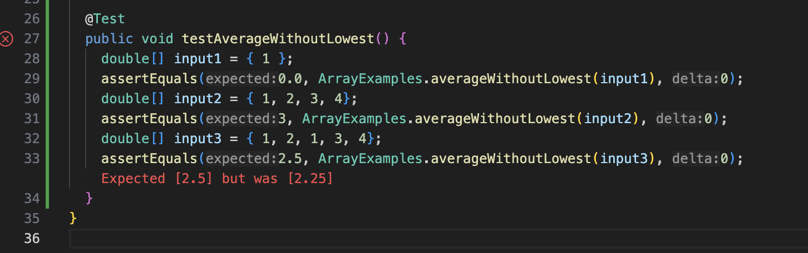

# Part 1<br>
## Faliure inducing input for averageWithoutLowest <br>

```
@Test
  public void testAverageWithoutLowest() {
    double[] input2 = { 1, 2, 1, 3, 4};
    assertEquals(2.5, ArrayExamples.averageWithoutLowest(input2), 0);
  }
```
## Input that doesn't cause error for averageWithoutLowest <br>
```
@Test
  public void testAverageWithoutLowest() {
    double[] input1 = { 1 };
    assertEquals(0.0, ArrayExamples.averageWithoutLowest(input1), 0);
    double[] input2 = { 1, 2, 3, 4};
    assertEquals(3, ArrayExamples.averageWithoutLowest(input2), 0);
  }
```
## Output of running tests for averageWithoutLowest <br>
 <br>
## Code for averageWithoutLowest before change<br>
```
 static double averageWithoutLowest(double[] arr) {
    if(arr.length < 2) { return 0.0; }
    double lowest = arr[0];
    for(double num: arr) {
      if(num < lowest) { lowest = num; }
    }
    double sum = 0;
    for(double num: arr) {
      if(num != lowest) { sum += num; }
    }
    return sum / (arr.length - 1);
  }
```
## Code for averageWithoutLowest after change<br>
```
static double averageWithoutLowest(double[] arr) {
    if(arr.length < 2) { return 0.0; }
    double lowest = arr[0];
    int index = 0;
    for(int i = 0; i < arr.length; i++) {
      if(arr[i] < lowest) { lowest = arr[i]; index = i;}
    }
    double sum = 0;
    for(int i = 0; i < arr.length; i++) {
      if(i != index) { sum += arr[i]; }
    }
    return sum / (arr.length - 1);
  }
```
This fixes the issue because instead of skipping all numbers in the array that equal to lowest, we take the index of the lowest and skip that. This way only one index is being skipped and not every instance of the lowest number. 

# Part 2<br>


