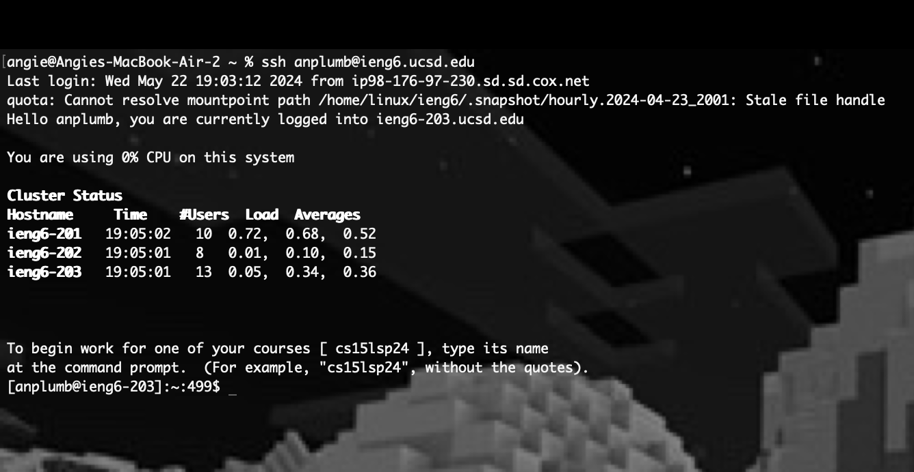
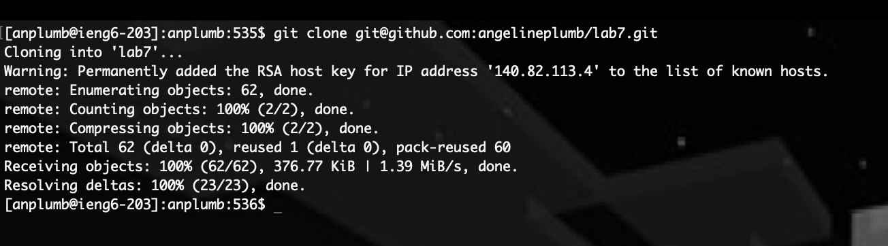
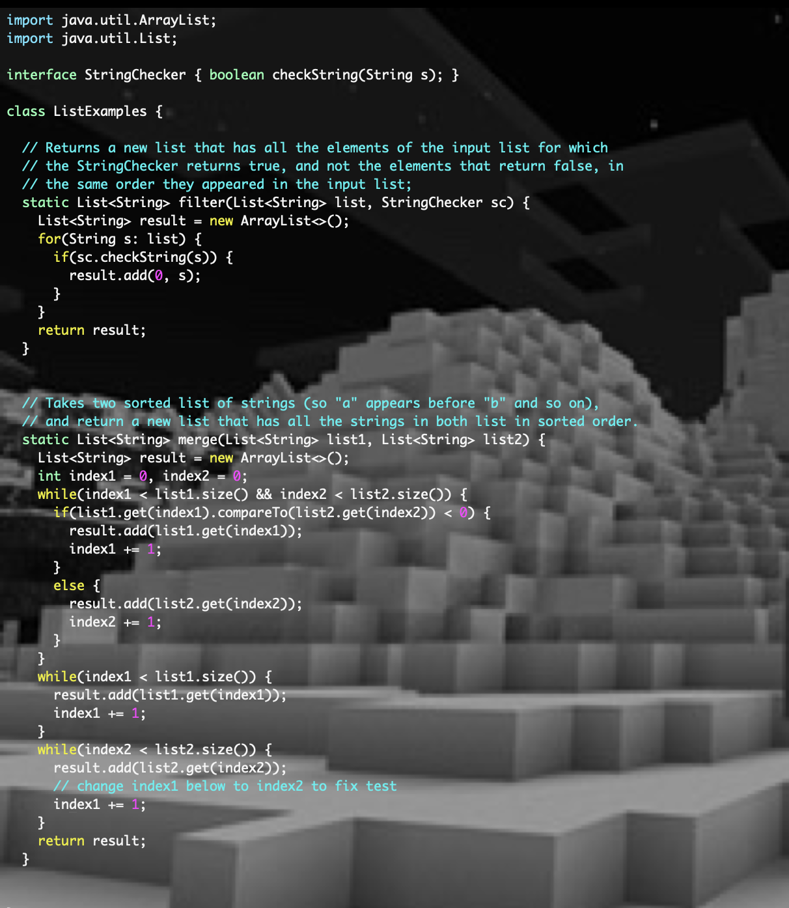
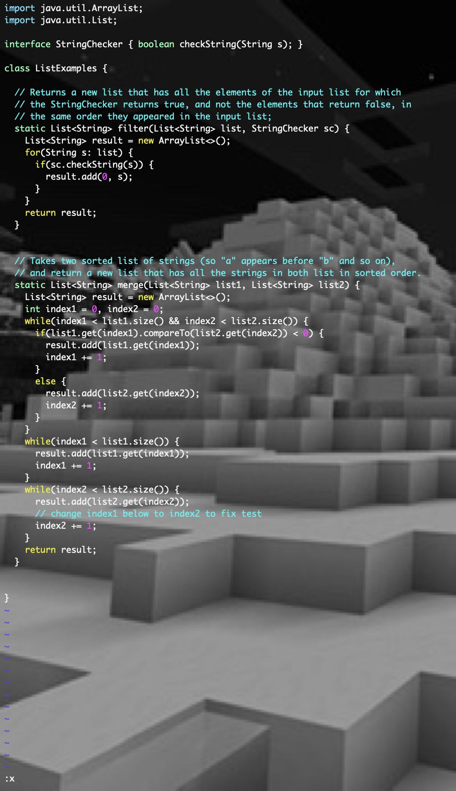
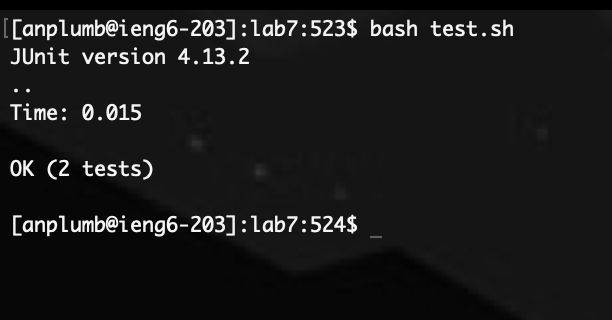
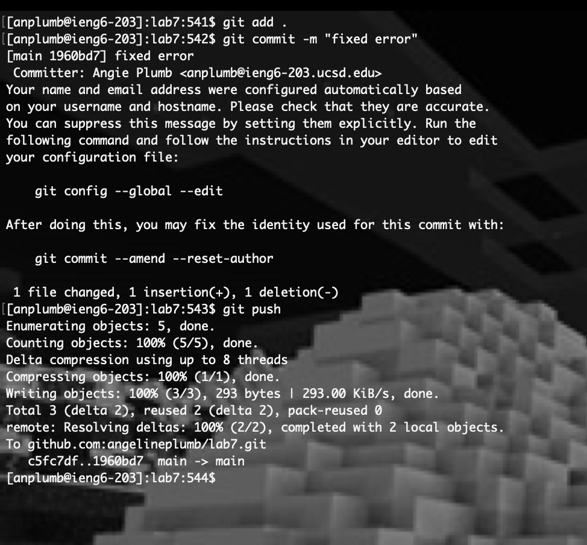

# Lab 4 Vim <br>
## Step 4 <br>
<br> <br> <br>
**'ssh```<Space>```anplumb@ieng6.ucsd.edu```<Enter>```' (27 Keypresses).** <br> <br>
This command will log me into the ieng6 server. 

## Step 5 <br>
<br> <br> <br>
**'git```<Space>```clone```<Space><Ctrl>```c```<Enter>```' (13 Keypresses).** <br> <br>
This command will clone the link of the repository that I forked. 

## Step 6 <br>
<br> <br> <br>
**'cd```<Space>```lab7```<Enter>```' (8 Keypresses).** <br> <br>
This command will enter into the directory of the repository I cloned. <br> <br>
**'bash```<Space>```test.sh```<Enter>```' (13 Keypresses).** <br> <br>
This commmand will run the tester methods. 

## Step 7 <br>
<br> <br> <br>
**'vim```<Space>```List```<Tab>```.java```<Enter>```' (15 Keypresses).** <br> <br>
This command will open the file containing the error using VIM. <br>
<br> <br> <br>
**'44```<Shift>```G```<Shift>```A```<left>``` ```<left>``` ```<left>``` ```<left>``` ```<left>``` ```<left>``` ```<del>```2```<Esc>```' (13 Keypresses).** <br> <br>
The first part of the command '44G' will move the cursor to the 44th line where the error is located. <br>
The second part 'Shift A' will allow me to insert and delete characters while also moving the cursor to the end of the line. <br>
I then use the left arrow key to move to the '1' in the variable index1 and press ```<del>``` and '2' to change the variable to index2. <br>
I then use ```<Esc>``` to exit into normal mode. <br> <br>
**'```<Shift>```:x```<Enter>```' (5 Keypresses).** <br> <br>
This command allows me to write the file and exit vim. 

## Step 8 <br>
<br> <br> <br>
**'bash```<Space>```test.sh```<Enter>```' (13 Keypresses).** <br> <br>
This command allows me to tun the tester methods again. 

## Step 9 <br>
<br> <br> <br>
**'git```<Space>```add```<Space>```.```<Enter>``` (10 Keypresses).** <br> <br>
This command will allow me to stage all changes. <br> <br>
**'git```<Space>```commit```<Space>```-m```<Space>```"fixed error```<Enter>``` (27 Keypresses).** <br> <br>
This command will allow me to commit the changes with the commit message "fixed error". <br> <br>
**'git```<Space>```push```<Enter>``` (9 Keypresses).** <br> <br>
Finally, this command will allow me to push changes back to my github profile. 


