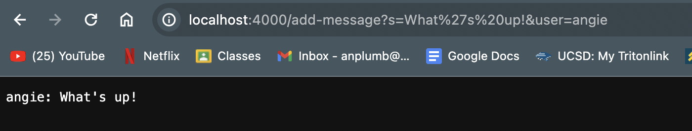
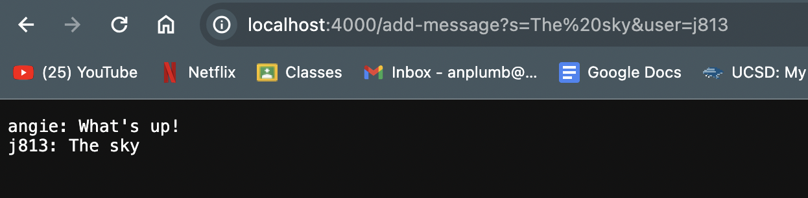

# Code for ChatServer.java <br>

```
import java.io.IOException;
import java.net.URI;
import java.util.ArrayList;

class Handler implements URLHandler{
    ArrayList<String> user = new ArrayList<String>();
    ArrayList<String> message = new ArrayList<String>();
    public String handleRequest(URI url){
        if (url.getPath().equals("/")) {
            if(user.size() == 0){
            return String.format("Send a message!");
            }
            else{
                String update = "";
                for(int i = 0; i < message.size(); i++){
                    update += String.format(user.get(i) + ": " + message.get(i) + "\n");
                }
                return update;
            }
        } else if (url.getPath().equals("/add-message")) {
            String[] chat = new String[4];
            String[] temp = url.getQuery().split("=");
            String[] m1 = temp[1].split("&");
            String u = temp[2];
            chat[0] = temp[0];
            chat[1] = m1[0];
            chat[2] = m1[1];
            chat[3] = u;
            System.out.println("test");
            if (chat[0].equals("s")) {
                message.add(chat[1]);
            }
            if (chat[2].equals("user")) {
                user.add(chat[3]);
            }
            String update = "";
            for(int i = 0; i < message.size(); i++){
                update += String.format(user.get(i) + ": " + message.get(i) + "\n");
            }
            return update;
        }
        return "404 Not Found!";
    }
}

public class ChatServer {
    public static void main(String[] args) throws IOException {
        if(args.length == 0){
            System.out.println("Missing port number! Try any number between 1024 to 49151");
            return;
        }

        int port = Integer.parseInt(args[0]);

        Server.start(port, new Handler());
    }
}
```
# ChatServer Output <br>
 <br>
My handleRequest method was called to produce this output. The relevant arguements to this method is `URI url` which gets the url that was inputted. In this case `URI = 'localhost:4000/add-message?s=What%27s%20up!&user=angie'`. My code then takes this input and splits it with characters '=' and '&' so that we can separate the message from the username. This is stored in the `String chat[]` variable. The array contains the following after add-message is used: `chat["s", "What's up!", "user", "angie"]`. I have set up two arrays `String message[]` and `String user[]` that will contain all messages that have been inputed with their corresponding users. I then created a `String update` variable that will contain both the user and the message in the proper format. 
 <br>
