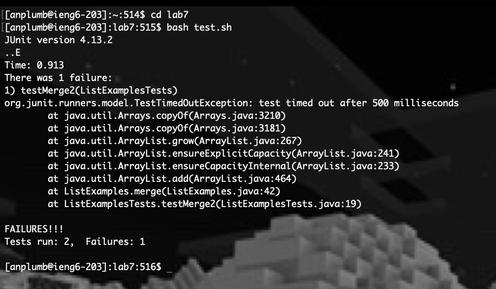

# Lab 4 Vim <br>
## Step 4 <br>
 <br>
'ssh```<Space>```anplumb@ieng6.ucsd.edu```<Enter>```' (27 Keypresses). <br>

## Step 5 <br>
 <br>
'git```<Space>```clone```<Space><Ctrl>```c```<Enter>```' (13 Keypresses). <br>

## Step 6 <br>
 <br>
'cd```<Space>```lab7```<Enter>```' (8 Keypresses). <br>
'bash```<Space>```test.sh```<Enter>```' (13 Keypresses). <br>

## Step 7 <br>
 <br>
'vim```<Space>```List```<Tab>```.java```<Enter>```' (15 Keypresses). <br>
 <br>
'44```<Shift>```G```<Shift>```A```<left>``` ```<left>``` ```<left>``` ```<left>``` ```<left>``` ```<left>``` ```<del>```2```<Esc>```' (13 Keypresses). <br>
'```<Shift>```:x```<Enter>```' (5 Keypresses). <br>

## Step 8 <br>
 <br>
'bash```<Space>```test.sh```<Enter>```' (13 Keypresses). <br>

## Step 9 <br>
 <br>
'git```<Space>```add```<Space>```.```<Enter>``` (10 Keypresses). <br>
'git```<Space>```commit```<Space>```-m```<Space>```"fixed error```<Enter>``` (27 Keypresses). <br>
'git```<Space>```push```<Enter>``` (9 Keypresses). <br>


